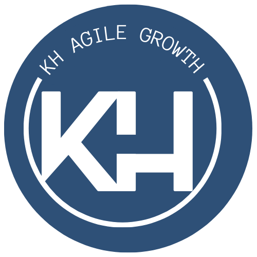

# KH Agile Growth

<div align="center">
  
</div>

## Sistema para Determinar el Modelo de Madurez de un Software

### Título del Proyecto
**Desarrollo de un Sistema para la Evaluación y Mejora del Modelo de Madurez de Software**

### Objetivo General
Desarrollar un sistema integral que facilite la evaluación del nivel de madurez de software mediante la asignación y seguimiento de medidas correctivas, optimizando procesos de mejora continua y generando reportes para la toma de decisiones.

---

## Alcance del Proyecto
El sistema está diseñado para organizaciones que buscan evaluar y mejorar el nivel de madurez de su software. El alcance incluye:

- **Gestión de usuarios y roles específicos:** administrador del sistema, líderes de proyecto y miembros del equipo.
- **Formularios de evaluación de madurez:** recopilar información y analizar áreas de mejora.
- **Generación automática de medidas correctivas:** basadas en las respuestas del formulario.
- **Seguimiento del estado de medidas correctivas:** (NO_APLICABLE, APLICADA, ACEPTADA, ABIERTA).
- **Dashboard interactivo:** monitoreo del progreso.
- **Reportes descargables:** en formato Excel.

---

## Características del Sistema

### Roles y Gestión de Usuarios

#### Administrador del Sistema
- Aceptar o rechazar solicitudes de nuevos usuarios.
- Editar datos de usuarios existentes.

#### Líder del Proyecto
- Crear nuevos proyectos.
- Agregar miembros al proyecto.

#### Miembro del Equipo
- Registrarse en el sistema.
- Consultar actividades correctivas asignadas.
- Visualizar el dashboard.
- Marcar actividades como "Aplicada".

### Evaluación de Madurez
- Formulario dinámico con lista seleccionable de métricas para evaluar el nivel de madurez.
- Categorización automática de medidas correctivas:
  - **NO_APLICABLE:** La medida no es relevante.
  - **APLICADA:** La medida ha sido implementada.
  - **ACEPTADA:** La medida ha sido asignada a un responsable.
  - **ABIERTA:** La medida está pendiente de aceptación.

### Gestión de Medidas Correctivas
- Lista de medidas correctivas organizadas por estado.
- Opciones para asignar medidas a miembros del equipo.
- Actualización del estado de medidas según su progreso.

### Dashboard
- Visualización gráfica de:
  - Niveles de madurez actuales.
  - Progreso de las medidas correctivas.
  - Indicadores clave derivados de la evaluación.
- Panel interactivo con filtros personalizables por proyecto o métrica.

### Generación de Reportes
- Exportación de reportes en formato Excel:
  - Resumen de evaluaciones realizadas.
  - Detalle del estado de medidas correctivas.
  - Análisis comparativo de progreso en el tiempo.

### Notificaciones por Correo Electrónico
- Enviar automáticamente notificaciones a los usuarios sobre:
  - Nuevas medidas correctivas asignadas.

### Indicadores de Impacto
- Medir el impacto real de las medidas implementadas sobre el modelo de madurez.
- Mostrar resultados cuantitativos.

---

## Beneficios Esperados
- Simplificación del proceso de evaluación y seguimiento del modelo de madurez de software.
- Mayor claridad en la asignación y progreso de medidas correctivas.
- Herramientas accesibles para la toma de decisiones basada en datos.
- Reducción de tiempo y esfuerzo en la gestión manual de evaluaciones.

---

## Instrucciones de Instalación y Ejecución
1. Clonar el repositorio:
   ```bash
   git clone https://github.com/KBGR55/kh-agile-growth-frontend.git
   ```
2. Navegar al directorio del proyecto:
   ```bash
   cd kh-agile-growth-frontend
   ```
3. Instalar las dependencias:
   ```bash
   npm install
   ```
4. Iniciar el servidor de desarrollo:
   ```bash
   npm start
   ```
5. Acceder a la aplicación en tu navegador:
   [http://localhost:3000](http://localhost:3000)

---

## Contribución
Si deseas contribuir al proyecto, por favor sigue los pasos:
1. Haz un fork del repositorio.
2. Crea una nueva rama para tus cambios:
   ```bash
   git checkout -b feature/nueva-funcionalidad
   ```
3. Realiza tus cambios y realiza un commit:
   ```bash
   git commit -m "Descripción de los cambios"
   ```
4. Sube tus cambios a tu rama:
   ```bash
   git push origin feature/nueva-funcionalidad
   ```
5. Abre un Pull Request en el repositorio original.

---

## Desarrolladores
- **Karen Gonzaga** - [GitHub](https://github.com/KBGR55)
- **Hilary Calva** - [GitHub](https://github.com/Hilary-Madelein)

## Instructor
- **Ing. Cristian Narvaez** - [GitHub](https://github.com/codernarvaez)

---

## Contacto
Para preguntas o soporte técnico, por favor contactar a: **[soporte@example.com](mailto:soporte@example.com)**
